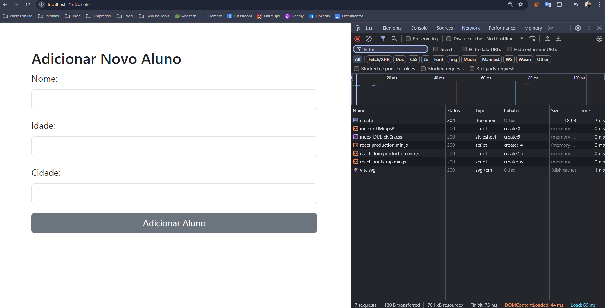

# Desafio de containerização de sistema com 3 serviços (Banco, Backend e Frontend).

# Sistema de Gerenciamento de Alunos.
Containerizando uma API de gerenciamento de alunos, construída com Node.js, Express, e MySQL. A API permite listar todos os alunos, obter detalhes de um aluno específico e adicionar novos alunos.

# Endpoint /alunos

# Endpoint /create

# Endpoint /aluno

